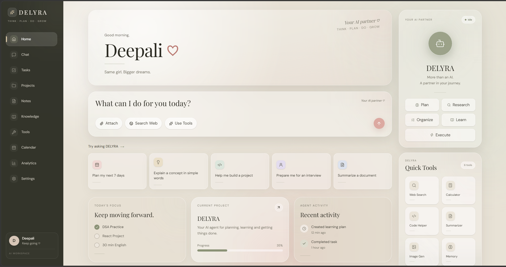
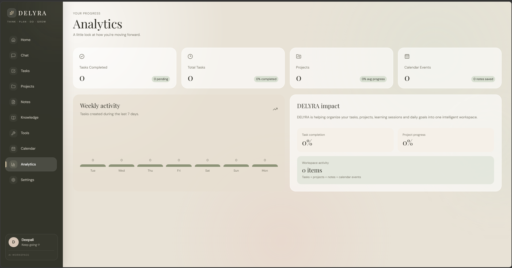
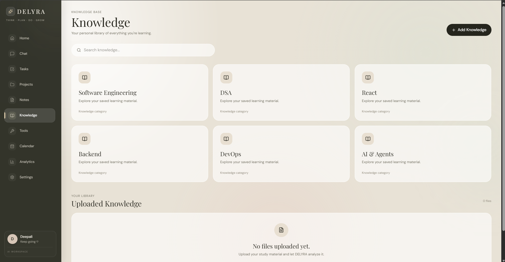

# DELYRA

### AI Agent & Personal Productivity Workspace

DELYRA is a full-stack AI agent designed to help users **think, plan, organize, learn, and execute tasks** from a single workspace.

Instead of functioning as only a chatbot, DELYRA combines AI reasoning with practical tools such as task management, notes, web search, calculations, projects, calendar management, and persistent memory.

---

## ✨ Features

### 🤖 AI Agent
- Natural language interaction with DELYRA
- Agent-based request processing
- Request understanding and planning
- Tool selection based on user intent
- Agent activity tracking
- Markdown-based AI responses

### 🧠 Persistent Memory
- Stores conversation-related memories
- Persistent database-backed memory
- Allows DELYRA to retain useful information across sessions

### 🔧 AI Tools
- Web Search
- Calculator
- Task Manager
- Notes
- Memory
- File Analyzer interface

### 📋 Productivity
- Task management
- Project management
- Project progress tracking
- Notes
- Calendar events
- Knowledge/document workspace
- Analytics dashboard

### 🎨 User Interface
- Premium glassmorphism design
- Warm cream, olive and blush color palette
- Responsive layout
- Desktop sidebar navigation
- Mobile navigation
- Interactive dashboard cards
- Agent activity visualization

---
## 📸 Screenshots

### 🏠 Home Dashboard



### 📊 Analytics Dashboard



### 📚 Knowledge Base




## 🏗️ Architecture

```text
                    ┌─────────────────────┐
                    │       User          │
                    └──────────┬──────────┘
                               │
                               ▼
                    ┌─────────────────────┐
                    │   React Frontend    │
                    │  TypeScript + Vite  │
                    └──────────┬──────────┘
                               │
                         REST API
                               │
                               ▼
                    ┌─────────────────────┐
                    │  Node.js + Express  │
                    └──────────┬──────────┘
                               │
                               ▼
                    ┌─────────────────────┐
                    │    Agent Engine     │
                    └──────────┬──────────┘
                               │
              ┌────────────────┼────────────────┐
              │                │                │
              ▼                ▼                ▼
        ┌──────────┐     ┌───────────┐    ┌──────────┐
        │  Gemini  │     │   Tools   │    │  Memory  │
        │   API    │     │           │    │          │
        └──────────┘     └───────────┘    └────┬─────┘
                                                │
                                                ▼
                                      ┌─────────────────┐
                                      │ PostgreSQL/     │
                                      │ Supabase        │
                                      └─────────────────┘


🧠 Agent Workflow

DELYRA follows an agent-oriented workflow:

User Request
     ↓
Understand Request
     ↓
Select Appropriate Tool
     ↓
Execute Tool
     ↓
Observe Result
     ↓
Generate Response
     ↓
Store Useful Memory


For example:

"Calculate 25 * 18"
        ↓
Detect calculator intent
        ↓
Calculator Tool
        ↓
450
        ↓
Return result


🛠️ Tech Stack
Frontend

React
TypeScript
Vite
Tailwind CSS
React Router
Framer Motion
Lucide React
React Markdown

Backend

Node.js
Express.js
TypeScript
REST APIs
AI
Google Gemini API
Agent Engine
Tool Selection
Tavily Web Search

Database

PostgreSQL
Supabase
Prisma
Development Tools
Git
GitHub
VS Code
npm


📁 Project Structure

DELYRA/
│
├── backend/
│   ├── src/
│   │   ├── agent/
│   │   │   ├── agent.engine.ts
│   │   │   ├── memory.ts
│   │   │   ├── tool.registry.ts
│   │   │   └── tool.selector.ts
│   │   │
│   │   ├── prisma/
│   │   │   ├── contract.prisma
│   │   │   ├── contract.json
│   │   │   ├── contract.d.ts
│   │   │   └── db.ts
│   │   │
│   │   ├── routes/
│   │   │   ├── ai.routes.ts
│   │   │   ├── calendar.routes.ts
│   │   │   ├── notes.routes.ts
│   │   │   ├── projects.routes.ts
│   │   │   └── tasks.routes.ts
│   │   │
│   │   ├── services/
│   │   │   └── gemini.service.ts
│   │   │
│   │   ├── tools/
│   │   │   ├── calculator.tool.ts
│   │   │   ├── note.tool.ts
│   │   │   ├── task.tool.ts
│   │   │   └── websearch.tool.ts
│   │   │
│   │   └── server.ts
│   │
│   ├── package.json
│   ├── prisma.config.ts
│   └── tsconfig.json
│
├── frontend/
│   ├── src/
│   │   ├── components/
│   │   │   ├── chat/
│   │   │   ├── home/
│   │   │   └── layout/
│   │   │
│   │   ├── pages/
│   │   │   ├── Analytics.tsx
│   │   │   ├── Calendar.tsx
│   │   │   ├── Chat.tsx
│   │   │   ├── Home.tsx
│   │   │   ├── Knowledge.tsx
│   │   │   ├── Notes.tsx
│   │   │   ├── Projects.tsx
│   │   │   ├── Settings.tsx
│   │   │   ├── Tasks.tsx
│   │   │   └── Tools.tsx
│   │   │
│   │   ├── App.tsx
│   │   ├── index.css
│   │   └── main.tsx
│   │
│   ├── package.json
│   └── vite.config.ts
│
├── .gitignore
└── README.md


🚀 Getting Started
1. Clone the repository
git clone git@github.com:deepali-kumari-iitp/DELYRA.git
cd DELYRA
2. Setup Backend
cd backend
npm install

Create a .env file:

GEMINI_API_KEY=your_gemini_api_key
TAVILY_API_KEY=your_tavily_api_key
DATABASE_URL=your_database_url
PORT=5000

Start the backend:

npm run dev

Backend runs on:

http://localhost:5000
3. Setup Frontend

Open another terminal:

cd frontend
npm install
npm run dev

Frontend runs on the Vite development server.

🔐 Environment Variables

The following environment variables are required for the backend:

Variable	Purpose
GEMINI_API_KEY	Gemini AI integration
TAVILY_API_KEY	Web search
DATABASE_URL	PostgreSQL/Supabase connection
PORT	Backend server port

Never commit your actual .env file or API keys to GitHub.

🧪 Current Capabilities

DELYRA currently supports:

AI conversations
Agent-based tool selection
Mathematical calculations
Web search
Task creation
Note creation
Project management
Calendar events
Persistent memory
Knowledge/document workspace
Analytics
Settings
Responsive UI


🔮 Future Improvements

Planned improvements include:

File upload and document analysis
More AI tools
Code assistance
Improved agent planning
Authentication and user accounts
Production deployment
Streaming AI responses
More advanced long-term memory
Additional productivity integrations

🎯 Project Goal

The goal of DELYRA is to move beyond traditional chatbot interactions and create an AI workspace where an agent can understand a user's goal, select appropriate tools, perform actions, and maintain useful context over time.

Think → Plan → Do → Grow
👩‍💻 Author

Deepali Kumari

Computer Science & Data Analytics
IIT Patna

⭐ If you find DELYRA interesting

Feel free to explore the project, suggest improvements, or contribute ideas.


